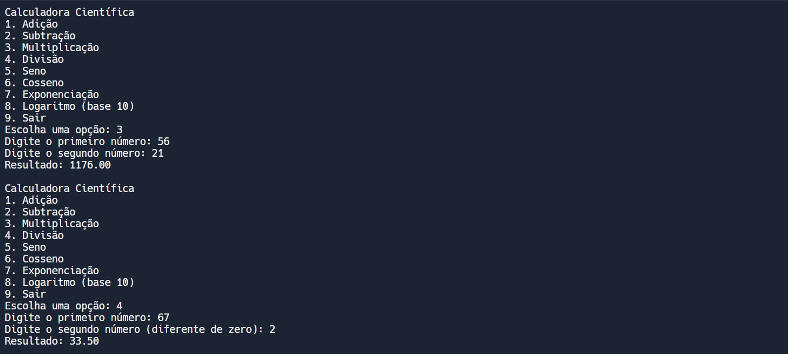
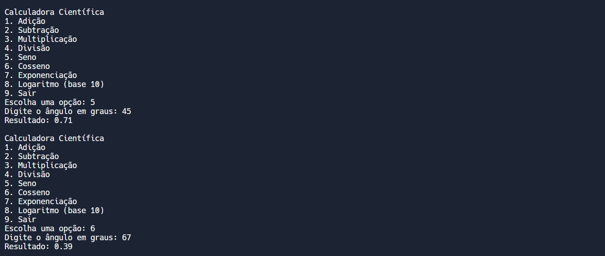
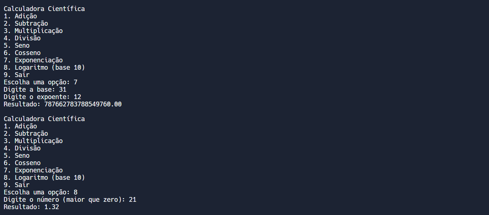

# CALCULADORA CIENTIFICA
👨‍🏫CALCULADORA CIENTÍFICA ESCRITA EM PASCAL.

 <br>
 <br>
 <br>
 <br>

## DESCRIÇÃO:
Este projeto é uma calculadora científica escrita em Pascal. A calculadora oferece operações matemáticas básicas e funções científicas, com validação de entrada para garantir que os dados fornecidos pelo usuário sejam válidos.

## FUNCIONALIDADES:
1. **Operações Básicas**:
   - **Adição**: Soma dois números fornecidos pelo usuário.
   - **Subtração**: Subtrai o segundo número do primeiro número fornecido pelo usuário.
   - **Multiplicação**: Multiplica dois números fornecidos pelo usuário.
   - **Divisão**: Divide o primeiro número pelo segundo número fornecido pelo usuário, com validação para evitar divisão por zero.

2. **Funções Científicas**:
   - **Seno**: Calcula o seno de um ângulo em graus fornecido pelo usuário.
   - **Cosseno**: Calcula o cosseno de um ângulo em graus fornecido pelo usuário.
   - **Exponenciação**: Calcula a potência de um número base elevado a um expoente fornecido pelo usuário.
   - **Logaritmo (base 10)**: Calcula o logaritmo de um número fornecido pelo usuário, com validação para garantir que o número seja maior que zero.

3. **Validação de Entrada**:
   - Verifica se as entradas fornecidas pelo usuário são números válidos.
   - Solicita a entrada novamente se uma entrada inválida for fornecida.
   - Valida condições específicas, como evitar divisão por zero e números negativos para logaritmo.

## COMO USAR?
1. **Compilar o código**:
   - Navegue até o diretório `./CODIGO`, e digite o seguinte comando para compilar o código:

   ```bash
   fpc main.pas
   ```

   - Isso vai gerar um arquivo executável:
      - **Windows**: `main.exe`
      - **Linux/macOS**: `main` (sem extensão).

2. **Executar o arquivo compilado**:
   - Depois de compilar o código, você pode executar o arquivo compilado diretamente no terminal:
   
   - **Windows**:
   ```bash
   main.exe
   ```

   - **Linux/macOS**:
   ```bash
   ./main
   ```

3. **Menu de Entrada**:
   - Ao iniciar o programa, um menu é exibido com as opções disponíveis.
   - O usuário escolhe uma das opções digitando o número correspondente e pressionando Enter.

4. **Entrada de Dados**:
   - Para cada operação, o programa solicita os dados necessários (números ou ângulos) e valida as entradas.
   - Se uma entrada inválida for fornecida, o programa exibirá uma mensagem de erro e solicitará a entrada novamente.

5. **Cálculo e Resultado**:
   - O programa realiza o cálculo correspondente e exibe o resultado no console.

6. **Repetição ou Encerramento**:
   - Após exibir o resultado, o programa retorna ao menu principal, permitindo ao usuário realizar novas operações.
   - O usuário pode encerrar o programa escolhendo a opção "Sair".

## NÃO SABE?
- Entendemos que para manipular arquivos em muitas linguagens e tecnologias, é necessário possuir conhecimento nessas áreas. Para auxiliar nesse aprendizado, oferecemos cursos gratuitos disponíveis:
* [CURSO DE PASCAL](https://github.com/VILHALVA/CURSO-DE-PASCAL)
* [CONFIRA MAIS CURSOS](https://github.com/VILHALVA?tab=repositories&q=+topic:CURSO)

## CREDITOS:
- [PROJETO CRIADO PELO VILHALVA](https://github.com/VILHALVA)


